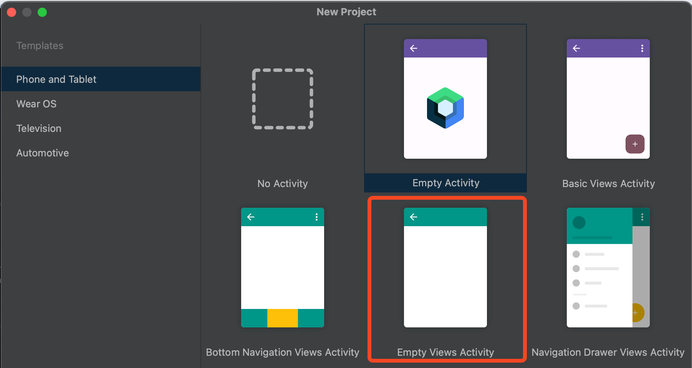

 # FoodBankApp
Proyecto creado para el banco de alimentos con fines administrativos para poder tener un mayor alcance en redes sociales así como una mejor administración de forma personalizada con sus usuarios donantes.

# Este proyecto se basa en el lenguje de programación de Kotlin

# Descargar el proyecto
1. Debes de localizar tu folder donde se va a clonar el repositorio
2. Clonas el repositorio en tu folder de tu elección
3. **Importante: Al momento en el que se clona el proyecto, se debe de abrir directamente de android studio. Una vez abierto Android Studio, le damos en "open project" y elegimos nuestro folder correspondiente donde se encuentran los archivos del repositorio que acabas de clonar**

# Restricciones 
**LA MÁS IMPORTANTE ES NO MODIFICAR EL "ANDROIDMANIFEST.XML". SI NECESITAN MODIFICARLO COMENTARLO CON TODO EL EQUIPO**
1. Cada quién cree su activity con nombres significativos de la forma de "Empty Activity" de la forma que no es con composable
   
3. Cuando crean una nueva Activity dentro del proyecto, se crea un nuevo archivo .xml ahí es donde van a modificar cualquier cosa del front-end correspondiente a su activity
4. Pueden agregar los drawables que quieran y que consideren necesario para darle formato a su activity. mientras no modifiquen drawables que no son suyos no tiene de qué preocuparse.**¡Denle estilo!**
5. **IMPORTANTE: No modificar los archivos de los demás para evitar merge conflicts. Puden reusar código de front end de los demás, pero no modifiquen archivos que no son suyos**
 .png)

